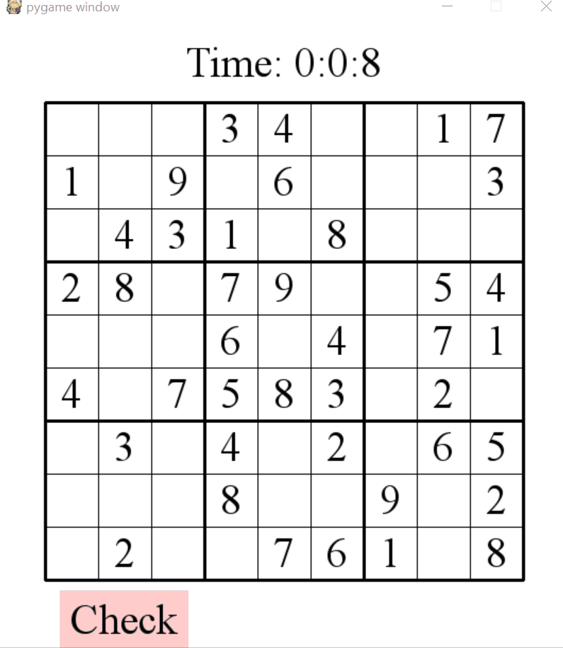

# sudoku
A sudoku game using Python
# About
I started in the top left of the board and generated 1 row at a time, randomly selecting numbers 1 to 9. If at any point in the row a number couldn't be generated then I reset the entire row and started over. Then a certain number of numbers are removed from random positions depending on the variable "remove" on line 314. 

The board is constantly updated to reflect moves done by the player and once the board is complete, the player can hit the "check" button which it will then check if all the numbers satisfy the conditions for Sudoku and if it does then the game closes and the time as well as the number of moves gets printed. 

Note: This was created to run using Python3.7. I did not test it using older versions. 
# How to run
To run the game:
```
python game.py
```
To change the number of numbers that are removed, change the "remove" variable found on line 314. 
# Demo

